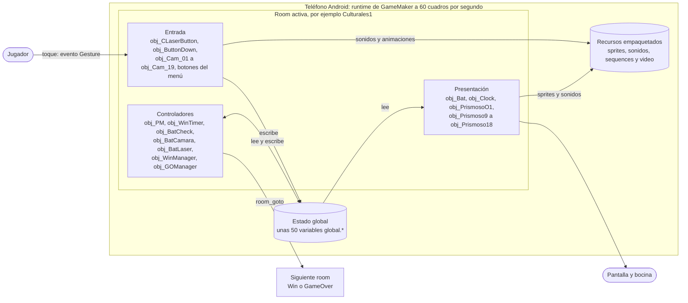
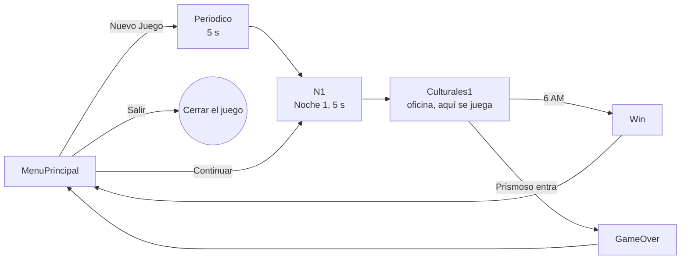
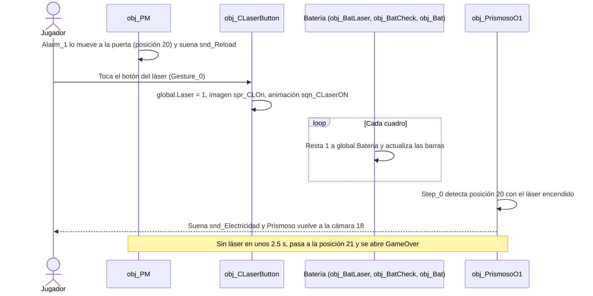

# Entrega 1 — Five Nights at ESCOM

**Equipo:** -
**Integrantes:** 
* Chávez Romero Jonathan - 2024630102 
* Moreno Noguerón Ximena - 2024630201 
* Reyes Castellanos José Abel - 2020311353
**Repositorio:** https://github.com/xime-ngrn/Five-Nights-at-ESCOM-Forked
**Última actualización:** 05/10/2026

## Índice

* [Parte 1. Material visual, historia de usuario y evidencias](idea.md)
* [Parte 2. Reconocimiento del proyecto base](ENTREGA.md)
  * [2.1 Estructura del repositorio](#21-estructura-del-repositorio)
  * [2.2 Arquitectura de la aplicación](#22-arquitectura-de-la-aplicación)
  * [2.3 Recorrido del código](#23-recorrido-del-código)
  * [2.4 Construcción y ejecución desde un clon limpio](#24-construcción-y-ejecución-desde-un-clon-limpio)
  * [2.5 Ejecución verificada por todos los integrantes](#25-ejecución-verificada-por-todos-los-integrantes)
  * [2.6 Matriz inicial de pruebas](#26-matriz-inicial-de-pruebas)
  * [Lista de verificación de la Parte 2](#lista-de-verificación-de-la-parte-2)
  * [Anexo. Hallazgos que afectan nuestra propuesta (v1)](#anexo-hallazgos-que-afectan-nuestra-propuesta-v1)

---

## Parte 1. Material visual, historia de usuario y evidencias

### 1.2 Material visual de la idea

Las imágenes van en `docs/evidencias/img/bocetos/`. 


#### Estados fuera de la ruta feliz


#### Esquema de la pantalla de juego (ruta de juego)


---

## Parte 2. Reconocimiento del proyecto base

Análisis del repositorio antes de modificarlo. Se hizo el 05/10/2026 sobre el commit `7ab6b03`, leyendo los archivos y consultando la API de GitHub.

### 2.1 Estructura del repositorio

#### Contenido

Es un proyecto de **GameMaker** con 4,703 archivos versionados.

| Carpeta o archivo | Tipo | Qué contiene |
|---|---|---|
| [`Five Nights at ESCOM.yyp`](../../../Five%20Nights%20at%20ESCOM.yyp) | Configuración | Archivo principal del proyecto, el que se abre con GameMaker. Lista los recursos, el orden de las rooms, los grupos de audio y texturas, los archivos incluidos y la versión del IDE (`2022.0.3.85`, de la rama LTS 2022). |
| [`objects/`](../../../objects) | Código | 80 objetos. Cada uno tiene un `.yy` y un `.gml` por evento: `Create_0`, `Step_0`, `Step_2` (fin de cada cuadro), `Alarm_N` (temporizadores), `Gesture_0` (toque en pantalla) y `Draw_0`. En total son unas 10,000 líneas de GML. |
| [`rooms/`](../../../rooms) | Código / interfaz | 10 pantallas: `MenuPrincipal`, `Periodico`, `N1`, `Culturales1` (la oficina, donde se juega), `Win`, `GameOver`, `N2`, `N134`, `N1345` y `Guardia`. |
| [`sequences/`](../../../sequences) | Recursos | 13 animaciones: transiciones, subir y bajar la cámara, láser, glitch, jumpscare y victoria. |
| [`sprites/`](../../../sprites) | Recursos | 860 sprites (72 MB): 225 propios del juego (190 en uso) y 635 de un paquete genérico que no se usa. |
| [`sounds/`](../../../sounds) | Recursos | 210 sonidos (12 MB): 15 propios del juego (14 en uso) y 195 de un paquete genérico que no se usa. |
| [`datafiles/`](../../../datafiles) | Recursos | `vd_PSJS1.mp4` (27 MB), el video del jumpscare. |
| [`options/`](../../../options) | Configuración | Opciones por plataforma (main, android, windows, ios, mac, linux, html5, operagx y tvos) e íconos. |
| [`docs/`](../../) | Documentación | Documentos del curso: ficha de idea, esta entrega, pruebas y licencias. |
| `README.md` y `.gitattributes` | Documentación / configuración | Descripción del repositorio y normalización de los saltos de línea. |

No hay módulos separados, scripts, fuentes, shaders ni extensiones: todo el código vive en los eventos de los objetos.

**Todo el código está hecho con bloques visuales (Drag and Drop).** Cada `.gml` guarda los bloques como comentarios `/// @DnD…` seguidos del código que generan. Ejemplo completo, [`obj_Continuar/Gesture_0.gml`](../../../objects/obj_Continuar/Gesture_0.gml):

```gml
/// @DnDAction : YoYo Games.Rooms.Go_To_Room
/// @DnDVersion : 1
/// @DnDHash : 74F54F49
/// @DnDArgument : "room" "N1"
/// @DnDSaveInfo : "room" "N1"
room_goto(N1);
```

Los comentarios son lo que el editor realmente guarda. Si se edita el `.gml` a mano sin respetarlos, el editor puede perder el cambio; por eso es mejor editar desde GameMaker.

#### Punto de entrada y configuración de construcción

**Punto de entrada.** GameMaker no tiene una función `main`: el juego arranca en la **primera room** de la lista `RoomOrderNodes`, que se declara en [`Five Nights at ESCOM.yyp`](../../../Five%20Nights%20at%20ESCOM.yyp) (línea 1197):

```
  "RoomOrderNodes": [
    {"roomId":{"name":"MenuPrincipal","path":"rooms/MenuPrincipal/MenuPrincipal.yy",},},
    {"roomId":{"name":"N1","path":"rooms/N1/N1.yy",},},
```

Al entrar a `MenuPrincipal`, GameMaker crea sus instancias en el orden definido en la room y ejecuta el evento `Create` de cada una:

1. [`obj_MM_Empty/Create_0.gml`](../../../objects/obj_MM_Empty/Create_0.gml): detiene todo el audio y reproduce en bucle la música del menú (`snd_MM`).
2. `obj_DGlitch`, `obj_NuevoJuego`, `obj_Continuar`, `obj_Opciones`, `obj_Extras`, `obj_Salir` y `obj_static`: el efecto glitch y los botones del menú.
3. [`obj_Coco/Create_0.gml`](../../../objects/obj_Coco/Create_0.gml): se crea al final e inicializa las ~50 variables `global.*` del juego.

**Configuración de construcción.** GameMaker no usa un `build.gradle` versionado: genera el proyecto de Android (con Gradle) en su carpeta temporal al compilar. Lo equivalente en el repositorio son estos archivos:

| Archivo | Qué declara |
|---|---|
| [`Five Nights at ESCOM.yyp`](../../../Five%20Nights%20at%20ESCOM.yyp) | Recursos del proyecto, orden de las rooms, configuración `Default`, grupo de texturas (`Default`, comprimido en bz2), grupo de audio, archivos incluidos (`vd_PSJS1.mp4`) y versión del IDE. |
| [`options/main/options_main.yy`](../../../options/main/options_main.yy) | Velocidad del juego (60 cuadros por segundo) e identificador del juego. |
| [`options/android/options_android.yy`](../../../options/android/options_android.yy) | Nombre "Five Nights at ESCOM DEMO", versión 0.1.0, paquete `com.company.game`, compila con SDK 35 (también es el SDK objetivo), SDK mínimo 16, solo **arm64**, orientación horizontal, íconos y permisos (`WRITE_EXTERNAL_STORAGE` activado, `INTERNET` desactivado). |
| [`options/windows/options_windows.yy`](../../../options/windows/options_windows.yy) | Nombre del ejecutable, versión 0.1.0.0, autor ("Carlos Adrian Hernandez Torres") y descripción ("Un Fangame de FNAF"). |

#### `.gitignore`

**El repositorio no tiene `.gitignore`**, ni en ninguna rama ni en el historial; el *upstream* tampoco. Por eso git no excluye nada: cualquier archivo que aparezca en la carpeta se puede subir.

Hoy no hay archivos sobrantes porque GameMaker compila y guarda su caché fuera del proyecto (en `%AppData%` y `%LocalAppData%`). Un `.gitignore` típico de GameMaker excluiría:

| Qué | Ejemplos | Por qué no se versiona |
|---|---|---|
| Lo que se exporta | `*.apk`, `*.aab`, `*.exe`, `*.zip`, `*.yyz` | Se puede regenerar desde el código y son archivos binarios pesados. |
| Preferencias personales del IDE | `*.resource_order` (versiones recientes de GameMaker) | Cambian con cada persona y provocan conflictos. |
| Archivos del sistema y respaldos | `Thumbs.db`, `desktop.ini`, `*.bak`, `*.old` | No forman parte del proyecto. |

La única configuración de git es [`.gitattributes`](../../../.gitattributes) con `* text=auto`, que unifica los saltos de línea. No se usa Git LFS, aunque hay 72 MB de imágenes y un video de 27 MB; ningún archivo supera el límite de 100 MB de GitHub.

#### Integración continua

**No hay flujos de trabajo de integración continua.** No existe la carpeta `.github/workflows` en este fork, en el *upstream* ni en el repositorio original, así que nada se comprueba automáticamente: ni que compile, ni pruebas. Compilar GameMaker en un servidor requiere una licencia y su herramienta de línea de comandos (Igor), por lo que es raro verlo en proyectos escolares.

#### Licencia y procedencia de los recursos externos

El proyecto **no tiene licencia**: todos los derechos pertenecen al autor original, Carlos Adrián Hernández Torres. El registro completo está en [`docs/LICENCIAS.md`](../../LICENCIAS.md):
* cadena de forks y cómo se verificó que no hay licencia;
* qué permite y qué no permite GitHub;
* procedencia de los recursos externos (FNAF y un paquete genérico de 635 sprites y 195 sonidos de origen no documentado);
* herramientas utilizadas y reglas de uso para el equipo.

### 2.2 Arquitectura de la aplicación

#### Diagrama de arquitectura

GameMaker no usa MVC. Se organiza en **rooms (pantallas), objetos y eventos**, y el juego corre a 60 cuadros por segundo. En cada cuadro, el runtime de GameMaker ejecuta los eventos de cada objeto, los temporizadores que vencen y los toques en pantalla.



*Figura 2.1. Componentes del juego y cómo se comunican.*

Los objetos casi nunca se llaman entre sí. Se comunican de cuatro formas:

| Mecanismo | Ejemplo real |
|---|---|
| **Variables globales** (la forma principal) | `obj_CLaserButton` escribe `global.Laser = 1` y `obj_PrismosoO1` lo lee para decidir si repele a Prismoso. |
| **Bloques `with(objeto)`**: un objeto modifica directamente a otro | `obj_WinTimer` cambia el sprite de `obj_Clock` en cada hora; `obj_CLaserButton` cambia el sprite de `obj_CLaser`. |
| **Temporizadores** (`alarm_set`): un objeto programa sus propios eventos futuros | `obj_PM` decide si Prismoso se mueve cada 150 cuadros. |
| **Cambio de room** (`room_goto`): destruye las instancias de la room actual y crea las de la siguiente | `obj_WinTimer` cambia a `Win` a las 6 AM; `obj_PrismosoO1` cambia a `GameOver`. |

El flujo entre rooms es el siguiente:



*Figura 2.2. Flujo de pantallas (rooms) del proyecto base.*

Otros datos de la arquitectura:
* **El tiempo se mide en cuadros, no en segundos.** Una hora del juego son 3600 cuadros (60 s), así que la noche dura unos 9 minutos reales. La batería completa dura 14,400 cuadros, unos 4 minutos de uso continuo.
* **La oficina y el monitor de cámaras están en la misma room** (`Culturales1`). La cámara de 1280×720 se coloca en y=0 para la oficina o en y=928 para el monitor ([`obj_ButtonDown/Step_2.gml`](../../../objects/obj_ButtonDown/Step_2.gml)).

#### Dónde vive la lógica, la interfaz y los datos

| Parte | Dónde | Ejemplos |
|---|---|---|
| Lógica | Objetos controladores en `objects/` | [`obj_PM/Alarm_0.gml`](../../../objects/obj_PM/Alarm_0.gml) y [`Alarm_1.gml`](../../../objects/obj_PM/Alarm_1.gml) (inteligencia y recorrido de Prismoso), [`obj_WinTimer/Alarm_0.gml`](../../../objects/obj_WinTimer/Alarm_0.gml) (horas y victoria), [`obj_BatCheck/Step_2.gml`](../../../objects/obj_BatCheck/Step_2.gml) (barras de batería), [`obj_PrismosoO1/Step_0.gml`](../../../objects/obj_PrismosoO1/Step_0.gml) (repeler o perder), [`obj_Culturales1/Step_0.gml`](../../../objects/obj_Culturales1/Step_0.gml) (deslizar la oficina) |
| Interfaz | `rooms/*.yy` (acomodo de los elementos), `sprites/`, `sequences/` y objetos visibles | Botones que responden al toque (`obj_NuevoJuego`, `obj_Continuar`, `obj_Salir`, `obj_ButtonDown`, `obj_CLaserButton`, `obj_Cam_01` a `obj_Cam_19`) e indicadores (`obj_Bat`, `obj_Clock`, `obj_Prismoso9` a `obj_Prismoso18`, `obj_Dots`, `obj_Lugares`) |
| Datos | **No existe** | No hay ninguna instrucción para guardar o leer archivos (`ini_open`, `file_text_*`, `buffer_save`, `json_*`). Todo vive en memoria y se pierde al cerrar el juego. Lo único que se lee de disco es el video, en [`obj_PMJS/Create_0.gml`](../../../objects/obj_PMJS/Create_0.gml). |

Lógica e interfaz no están separadas del todo. Por ejemplo, `obj_WinTimer` cuenta las horas y también cambia la imagen del reloj.

#### Dependencias externas

El proyecto no usa extensiones ni bibliotecas de terceros: la carpeta `Extensiones` del IDE está vacía y en las opciones de Android están desactivados Facebook, el guardado en la nube de Google y Google Play Services. Las dependencias reales son el motor y las herramientas de compilación:

| Dependencia | Para qué se usa |
|---|---|
| Runtime de GameMaker (LTS 2022.0.3, modo VM) | Ejecuta el juego en el dispositivo y aporta todas las funciones que usa el código. Las más usadas: `layer_sequence_*` (81 llamadas, animaciones), `audio_*` (70, sonido), `alarm_set` (48, temporizadores), `room_goto` (9, cambio de pantalla), `camera_*` (8, mover la vista) y `video_open` / `video_draw` (3, video del jumpscare). |
| Android SDK (Platform 35, Build-Tools 34.0.0, Platform-Tools) | Compilar y empaquetar el APK, e instalarlo en el dispositivo con `adb`. |
| Android NDK 27.0.12077973 | GameMaker lo exige para compilar el runtime de Android. |
| JDK (OpenJDK 17 a 21) y Gradle 8.5 | GameMaker genera un proyecto de Gradle y lo compila con el JDK configurado. |

#### Qué se ejecuta en el dispositivo y qué depende de servicios externos

**Todo se ejecuta en el dispositivo; el juego no depende de ningún servicio externo.**
* No hay ninguna llamada de red: `http_*`, `network_*`, `url_open`, compras, anuncios ni logros.
* El permiso `INTERNET` está desactivado (`option_android_permission_internet: false`).
* No hay extensiones que puedan conectarse a servicios.

Lo único que necesita internet es el IDE de GameMaker, que pide iniciar sesión con una cuenta de Opera; el juego compilado no. Un detalle: el permiso `WRITE_EXTERNAL_STORAGE` está activado aunque el juego no escribe ningún archivo.

### 2.3 Recorrido del código

#### Funcionalidad elegida: activar el láser para repeler a Prismoso

Es la mecánica de defensa principal del juego: abarca la entrada del jugador, la interfaz, la batería, la inteligencia del enemigo y el resultado en pantalla.



*Figura 2.3. Recorrido de la función "activar el láser".*

**Paso 1. Prismoso se prepara.** [`obj_PM/Create_0.gml`](../../../objects/obj_PM/Create_0.gml#L15-L26), líneas 15–26. Prismoso empieza en la cámara 18 y programa su primer movimiento para dentro de 150 cuadros (2.5 s):

```gml
global.PMMov = 1;
PMTiempo = 150;
global.PMPos = 18;
global.PMIA = 20;
PMComp = 0;
PMProb = 0;
alarm_set(0, PMTiempo);
```

**Paso 2. Decide si se mueve.** [`obj_PM/Alarm_0.gml`](../../../objects/obj_PM/Alarm_0.gml#L6-L73), líneas 6–73. Con `global.PMIA = 20`, `PMProb` vale 100. Entonces `random_range(0, 1)` redondeado hacia abajo siempre da 0, que es igual a `(100-100)/2`: **siempre se mueve** (alarma 1).

```gml
if(global.PMMov == 1)
{
	PMComp = 0;
	PMProb = (global.PMIA)*5;
	PMComp = floor(random_range(0, (100-PMProb) + 1));
	if(PMComp == (100-PMProb)/2)
	{
		global.PMMov = 0;
		alarm_set(1, 1);
	}
	else
	{
		global.PMMov = 0;
		alarm_set(2, 1);
	}
}
```

**Paso 3. Llega a la puerta.** [`obj_PM/Alarm_1.gml`](../../../objects/obj_PM/Alarm_1.gml#L56-L71), líneas 56–71 y 219–247. Recorre las cámaras 18 → 16 → 14 o 15 → … → 12 → 9 → 10 → 20. Al pasar de la 10 a la puerta (20) suena `snd_Reload`, la pista para el jugador. Si sigue en la puerta en su siguiente turno, pasa a 21.

```gml
	case 10:
		global.PMPos = 20;
		audio_play_sound(snd_Reload, 0, 0, 1.0, undefined, 1.0);
		break;
		break;
	// …
	case 20:
		global.PMPos = 21;
		break;
		break;
}
global.PMMov = 1;
alarm_set(0, PMTiempo);
```

**Paso 4. El jugador busca el botón.** El botón está a la derecha de la oficina. Al crearse guarda su distancia al fondo ([`obj_CLaserButton/Create_0.gml`](../../../objects/obj_CLaserButton/Create_0.gml#L14), línea 14) y en cada cuadro se reacomoda para moverse junto con él ([`obj_CLaserButton/Step_2.gml`](../../../objects/obj_CLaserButton/Step_2.gml#L1), línea 1). El fondo se desliza según la posición del dedo en [`obj_Culturales1/Step_0.gml`](../../../objects/obj_Culturales1/Step_0.gml#L12-L18).

```gml
anchorX = x - obj_Culturales1.x;     // Create_0.gml
x = obj_Culturales1.x + anchorX;     // Step_2.gml
```

**Paso 5. Toca el botón.** El toque dispara el evento Gesture Tap: [`obj_CLaserButton/Gesture_0.gml`](../../../objects/obj_CLaserButton/Gesture_0.gml#L6-L71), líneas 6–71 y 141–158. Si queda batería y el láser está apagado:
* lo enciende con sonido en bucle;
* activa las variables que leen la batería y Prismoso;
* cambia la imagen del botón;
* arranca la animación;
* programa la alarma 0 para dentro de 13 cuadros.

Si no queda batería, solo suena `snd_EmptyButton`.

```gml
if(global.BatConteo > 0)
{
	if(global.Laser == 0)
	{
		audio_stop_sound(snd_Laser);
		audio_play_sound(snd_Laser, 0, 1, 1.0, undefined, 1.0);
		global.Laser = 1;
		global.BatLaser = 1;
		sprite_index = spr_CLOn;
		image_index = 0;
		global.secLaser = layer_sequence_create("Lasers", x-441, 380, sqn_CLaserON);
		alarm_set(0, 13);
	}
	// … (rama para apagar, ver paso 10)
}
else
{
	audio_stop_sound(snd_EmptyButton);
	audio_play_sound(snd_EmptyButton, 0, 0, 1.0, undefined, 1.0);
}
```

**Paso 6. El haz queda fijo.** [`obj_CLaserButton/Alarm_0.gml`](../../../objects/obj_CLaserButton/Alarm_0.gml#L5-L16), líneas 5–16. Termina la animación de encendido y el objeto `obj_CLaser` muestra el haz:

```gml
layer_sequence_destroy(global.secLaser);
with(obj_CLaser) {
sprite_index = spr_CLaser1;
image_index = 0;
}
```

**Paso 7. Gasta batería en cada cuadro.** Mientras el láser está encendido, [`obj_BatLaser/Step_2.gml`](../../../objects/obj_BatLaser/Step_2.gml#L6-L15) resta 1. [`obj_BatCheck/Step_2.gml`](../../../objects/obj_BatCheck/Step_2.gml#L5-L89) convierte la batería en barras y, en 0, lo apaga todo. [`obj_Bat/Step_2.gml`](../../../objects/obj_Bat/Step_2.gml#L5-L47) cambia el ícono.

```gml
// obj_BatLaser/Step_2.gml
if(global.BatLaser == 1)
{
	global.Bateria = global.Bateria-1;
}
```

```gml
// obj_BatCheck/Step_2.gml
var l0184DB3D_0 = global.Bateria;
switch(l0184DB3D_0)
{
	case 0:
		audio_stop_sound(snd_Laser);
		global.BatConteo = 0;
		global.blockCam = 0;
		global.Laser = 0;
		global.BatCamara = 0;
		global.BatLaser = 0;
		// …
	case 2880:
		global.BatConteo = 1;
		break;
		break;
	// … (5760, 8640 y 11520 → 2, 3 y 4 barras)
}
```

```gml
// obj_Bat/Step_2.gml
var l38458401_0 = global.BatConteo;
switch(l38458401_0)
{
	case 0:
		image_alpha = 0;
		with(obj_EmptyBat) image_alpha = 1;
		break;
		break;
	case 1:
		sprite_index = spr_Bat5;
		image_index = 0;
	// …
```

**Paso 8. Resultado: Prismoso es repelido.** [`obj_PrismosoO1/Step_0.gml`](../../../objects/obj_PrismosoO1/Step_0.gml#L5-L100), líneas 5–100. En cada cuadro revisa la posición de Prismoso:
* **En la puerta con el láser encendido:** suena la descarga y Prismoso regresa a la cámara 18.
* **En la puerta con el láser apagado:** aparece en la oficina.
* **En la posición 21:** el jugador pierde.

```gml
var l40E6CC3D_0 = global.PMPos;
switch(l40E6CC3D_0)
{
	case 20:
		if(global.Laser == 1)
		{
			audio_play_sound(snd_Electricidad, 0, 0, 1.0, undefined, 1.0);
			global.PMPos = 18;
			break;
		}
		else
		{
			image_alpha = 1;
		}
		break;
	case 21:
		audio_stop_all();
		global.JSBy = 1;
		room_goto(GameOver);
		break;
	default:
		image_alpha = 0;
		break;
}
```

En pantalla, Prismoso desaparece de la oficina. Si el jugador abre la cámara 18, lo ve ahí: [`obj_Prismoso18/Step_0.gml`](../../../objects/obj_Prismoso18/Step_0.gml#L6-L20), líneas 6–20.

```gml
if(global.PMPos == 18)
{
	if(global.CamaraActiva == 18)
	{
		image_alpha = 1;
	}
	// …
```

**Paso 9. Si el jugador no reacciona a tiempo.** Prismoso pasa a la posición 21 y se abre la room `GameOver`. Ahí [`obj_GOManager/Create_0.gml`](../../../objects/obj_GOManager/Create_0.gml#L4-L51) crea `obj_PMJS`, que reproduce el video del jumpscare. Después se muestran la animación `sqn_PMGO` y el regreso al menú.

```gml
audio_stop_all();
SecGO = 0;
InstGO = 0;
var l410F1E72_0 = global.JSBy;
switch(l410F1E72_0)
{
	case 1:
		InstGO = instance_create_layer(0, 0, "Estatica", obj_PMJS);
		alarm_set(0, 620);
		break;
		break;
}
```

**Paso 10. Apagar el láser.** Un segundo toque entra a la rama `else` de [`obj_CLaserButton/Gesture_0.gml`](../../../objects/obj_CLaserButton/Gesture_0.gml#L77-L135), líneas 77–135:

```gml
	else
	{
		audio_stop_sound(snd_Laser);
		global.Laser = 0;
		global.BatLaser = 0;
		sprite_index = spr_CLOff;
		image_index = 0;
		with(obj_CLaser) {
		sprite_index = noone;
		image_index = 0;
		}
		global.secLaser = layer_sequence_create("Lasers", x-441, 380, sqn_CLaserOFF);
		alarm_set(1, 13);
	}
```

#### Archivos que habría que modificar para cambiar esta funcionalidad

| Para cambiar… | Archivos |
|---|---|
| Cuánta batería gasta el láser | [`obj_BatLaser/Step_2.gml`](../../../objects/obj_BatLaser/Step_2.gml) y, si cambian los umbrales, [`obj_BatCheck/Step_2.gml`](../../../objects/obj_BatCheck/Step_2.gml) y [`obj_Bat/Step_2.gml`](../../../objects/obj_Bat/Step_2.gml) |
| Qué pasa al repeler (a dónde regresa Prismoso, sonido) | [`obj_PrismosoO1/Step_0.gml`](../../../objects/obj_PrismosoO1/Step_0.gml) |
| Cuánto tiempo tiene el jugador para reaccionar | [`obj_PM/Create_0.gml`](../../../objects/obj_PM/Create_0.gml) (`PMTiempo`) |
| Probabilidad y recorrido de Prismoso | [`obj_PM/Alarm_0.gml`](../../../objects/obj_PM/Alarm_0.gml) y [`obj_PM/Alarm_1.gml`](../../../objects/obj_PM/Alarm_1.gml) |
| Encendido, apagado, sonido y animación del botón | [`obj_CLaserButton/Gesture_0.gml`](../../../objects/obj_CLaserButton/Gesture_0.gml), [`Alarm_0.gml`](../../../objects/obj_CLaserButton/Alarm_0.gml) y [`Alarm_1.gml`](../../../objects/obj_CLaserButton/Alarm_1.gml); [`sequences/sqn_CLaserON`](../../../sequences/sqn_CLaserON), [`sequences/sqn_CLaserOFF`](../../../sequences/sqn_CLaserOFF) y [`sounds/snd_Laser`](../../../sounds/snd_Laser) |
| Imagen del botón o del haz | [`sprites/spr_CLOn`](../../../sprites/spr_CLOn), [`sprites/spr_CLOff`](../../../sprites/spr_CLOff) y [`sprites/spr_CLaser1`](../../../sprites/spr_CLaser1) |
| Posición del botón en la oficina | [`rooms/Culturales1/Culturales1.yy`](../../../rooms/Culturales1/Culturales1.yy) (se edita desde el editor de rooms) |
| Qué se apaga cuando se acaba la batería | [`obj_BatCheck/Step_2.gml`](../../../objects/obj_BatCheck/Step_2.gml) (`case 0`) |

Los `.gml` se editan desde GameMaker para no romper los bloques Drag and Drop (ver 2.1).

### 2.4 Construcción y ejecución desde un clon limpio

#### Entorno utilizado

Equipo de referencia: computadora con Windows, revisada el 05/10/2026. Las versiones exigidas vienen de la guía oficial *Required SDKs for GameMaker's 2022.0 LTS Version*.

| Herramienta | Lo que exige la ruta (GameMaker LTS 2022.0.3) | Instalado en la computadora | Estado |
|---|---|---|---|
| Sistema operativo | Windows 10 u 11 de 64 bits | Windows 11 Home Single Language, compilación 10.0.26200 | ☑ |
| Git | Cualquier versión reciente | 2.49.0.windows.1 | ☑ |
| GameMaker | LTS 2022.0.3 (el `.yyp` indica IDE `2022.0.3.85`) | No instalado | ☐ Instalar |
| Android Studio | Solo se usa para administrar el SDK; GameMaker LTS lo probó hasta la versión Koala Patch 2 | 2026.1.3 (build 261.26222.65), en `D:\Nueva carpeta` | Más nuevo que lo probado y en una ruta con espacio |
| Android SDK Platform | 35 | 34, 35, 36 y 37.0 | ☑ |
| Android SDK Build-Tools | 34.0.0 | 36.0.0 | Instalar 34.0.0 |
| Android SDK Platform-Tools | 35.0.2 | 37.0.1 | Más nueva que la indicada |
| Android NDK | 27.0.12077973 | 28.2.13676358 | Instalar 27.0.12077973 |
| JDK | OpenJDK que pueda ejecutar Gradle 8.5 (versiones 17 a 21) | OpenJDK 25.0.2 (incluido en Android Studio) y Oracle JDK 17.0.10 | El 25 es demasiado nuevo para Gradle 8.5 y GameMaker desaconseja el JDK de Oracle: instalar OpenJDK 17 |
| Dispositivo de prueba | Android 5.0 (API 21) o superior, con procesador arm64 | Sin emulador creado | ☐ Pendiente |

#### Pasos para ejecutar desde un clon limpio

> Pasos preparados con la documentación oficial y la configuración del proyecto. Deben confirmarse durante la primera ejecución; si algo cambia, se corrige aquí y en el README.

**A. Obtener el proyecto**

1. Instalar Git para Windows.
2. Clonar el repositorio en una ruta **sin espacios ni acentos**:
   ```
   git clone https://github.com/xime-ngrn/Five-Nights-at-ESCOM-Forked.git C:\dev\fnaf-escom
   ```

**B. Instalar GameMaker y probar en la PC**

3. Crear una cuenta de Opera (si no se tiene) e instalar **GameMaker LTS 2022.0.3** desde gamemaker.io (sección *Download*, versión LTS). La licencia gratuita para uso no comercial es suficiente.
4. Abrir GameMaker, iniciar sesión y abrir `C:\dev\fnaf-escom\Five Nights at ESCOM.yyp`.
   * Si GameMaker ofrece convertir o actualizar el proyecto, **cancelar**: significa que se instaló una versión distinta de la LTS 2022.
5. En la barra de destino (arriba a la derecha), elegir **Windows**, **VM** y la configuración **Default**. Presionar **Run (F5)**.
   * Resultado esperado: se abre el menú con "Nuevo Juego", "Continuar" y "Salir" y suena la música.
   * Los toques se simulan con el mouse.

**C. Preparar Android**

6. Abrir Android Studio → *Settings → Languages & Frameworks → Android SDK*. Cambiar la ubicación del SDK a `C:\Android\Sdk`.
7. En la pestaña *SDK Platforms*, instalar **Android SDK Platform 35**.
8. En la pestaña *SDK Tools*, activar *Show Package Details* e instalar:
   * **Android SDK Build-Tools 34.0.0**
   * **NDK (Side by side) 27.0.12077973**
   * **Android SDK Platform-Tools**
9. Instalar un **OpenJDK 17** (por ejemplo, Eclipse Temurin 17 o Microsoft Build of OpenJDK 17). No usar el JDK 25 que trae Android Studio 2026.1.3.
10. Si el usuario de Windows tiene espacios o acentos, cambiar también la carpeta temporal de GameMaker a una ruta simple, como `C:\GMTemp` (*Preferences → General Settings → Paths*).
11. En GameMaker, ir a *File → Preferences → Platform Settings → Android* y configurar:
    * SDK: `C:\Android\Sdk`
    * NDK: `C:\Android\Sdk\ndk\27.0.12077973`
    * JDK: la carpeta donde se instaló OpenJDK 17

    Después presionar **Check Android SDK** y confirmar que no marque errores.

**D. Ejecutar en el teléfono**

12. En el teléfono, activar las *Opciones de desarrollador* y la *Depuración USB*. Conectarlo por USB y aceptar la huella RSA.
13. Comprobar que se detecta:
    ```
    C:\Android\Sdk\platform-tools\adb devices
    ```
14. En GameMaker, elegir como destino **Android**, **VM** y el dispositivo conectado. Presionar **Run**.
    * Resultado esperado: se instala y abre "Five Nights at ESCOM DEMO" en horizontal.
15. *(Alternativa)* Usar *Build → Create Executable* para generar el `.apk` e instalarlo:
    ```
    adb install -r ruta\al\archivo.apk
    ```

#### Problemas encontrados en la primera ejecución

| Riesgo | Evidencia | Qué hacer si ocurre |
|---|---|---|
| El SDK está en una ruta con espacio y acento | `C:\Users\Ximena Noguerón\AppData\Local\Android\Sdk`; la guía de GameMaker pide instalar cerca de la raíz y sin espacios | Pasos 6 y 10 |
| El JDK de Android Studio es demasiado nuevo | Android Studio 2026.1.3 incluye OpenJDK 25.0.2; Gradle 8.5 solo funciona hasta Java 21 | Paso 9 |
| Build-Tools y NDK distintos a los exigidos | Están instalados 36.0.0 y 28.2.13676358; se piden 34.0.0 y 27.0.12077973 | Paso 8 |
| SDK mínimo menor al permitido | El proyecto declara SDK mínimo 16 y GameMaker LTS 2022.0.3 solo admite 21 o más | Cambiarlo a 21 en *Game Options → Android* (modifica `options_android.yy`) |
| El APK no se instala en el emulador | El proyecto solo genera para arm64 y los emuladores de PC son x86_64 (`INSTALL_FAILED_NO_MATCHING_ABIS`) | Probar en un teléfono físico o activar x86_64 en *Game Options → Android → Architecture* |
| El proyecto se convierte al abrirlo | Abrirlo con una versión de GameMaker distinta de la LTS 2022 reescribe cientos de archivos `.yy` | Paso 4: cancelar e instalar la LTS 2022 |

### 2.5 Ejecución verificada por todos los integrantes

Cada integrante clona el repositorio en su propia computadora, lo ejecuta y toma una captura o fotografía. En la misma imagen deben verse **la aplicación en ejecución** y **algo que identifique a quien la tomó**: el nombre de usuario del sistema, una terminal con `git config user.name` o el IDE abierto con el proyecto.

Las evidencias van en `docs/evidencia/entrega-1/`, con el formato `apellido-nombre-entrega1.png`.

| Integrante | Archivo de evidencia | Sistema operativo y versión de GameMaker | ¿Lo ejecutó? | Si falló: error exacto, qué intentó y en qué estado quedó |
|---|---|---|---|---|
| Chávez Romero Jonathan | `chavez-jonathan-entrega1.png` | | ☑ | |
| Moreno Noguerón Ximena | `moreno-ximena-entrega1.png` | Windows 11 - 2026.0.0.16 | ☑ | |
| Reyes Castellanos José Abel | `reyes-jose-entrega1.png` | | ☐ | |

> Si alguien no consigue ejecutarlo, se documenta el error exacto, lo que intentó y cómo quedó. El fallo documentado no se penaliza; la omisión sí.

### 2.6 Matriz inicial de pruebas

La matriz completa va en [`PRUEBAS.md`](PRUEBAS.md), con el dispositivo o la API, los pasos, el resultado esperado y el resultado real de cada caso. **Hoy ese archivo está vacío.**

Casos propuestos según lo que pide la rúbrica y cómo funciona el juego:

| ID | Tipo | Caso propuesto | Por qué aplica a este juego |
|---|---|---|---|
| P-01 | Flujo principal | Nuevo Juego → sobrevivir hasta las 6 AM → pantalla de victoria → regreso al menú | Es la tarea principal del usuario. |
| P-02 | Datos vacíos o inválidos | Agotar la batería y tocar el láser y las cámaras; tocar **Continuar** sin haber jugado antes | El juego no tiene campos de texto. Su equivalente son las acciones sin recursos (deben sonar `snd_EmptyButton` sin activarse) y el botón sin partida guardada. |
| P-03 | Rotación o recreación | Girar el teléfono 180° y mandar el juego a segundo plano a mitad de la noche y volver | Solo admite horizontal (normal e invertida). Hay que ver si conserva la noche, la batería y el audio. |
| P-04 | Red no disponible | Jugar una noche completa en modo avión | No usa red (ver 2.2). La prueba confirma que funciona igual sin conexión. |
| P-05 | Accesibilidad con texto ampliado | Poner al máximo el tamaño de fuente y de pantalla del sistema y recorrer el menú, la oficina y las cámaras | El texto del juego son imágenes, así que no crece. Hay que registrar si algo queda cortado o ilegible. |
| P-06 | Extra: posible defecto | Usar cámara y láser al mismo tiempo hasta agotar la batería | `obj_BatCheck` solo cambia de barra cuando la batería vale exactamente 2880, 0, etc. (ver el anexo, hallazgo 9). |

**Issues.** Cada defecto encontrado se registra como una issue reproducible del repositorio. ⚠️ **El fork tiene los Issues desactivados** (GitHub los desactiva en los forks): hay que activarlos en *Settings → General → Features → Issues* antes de registrar defectos. Todavía no hay defectos confirmados.
