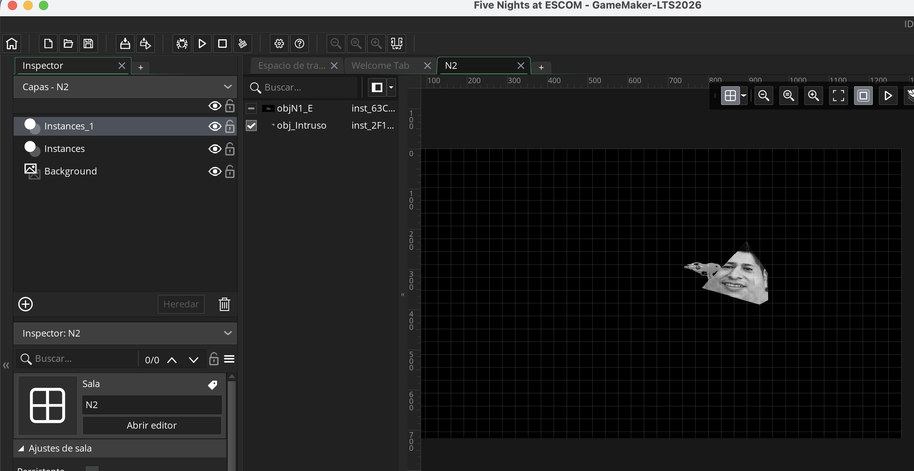
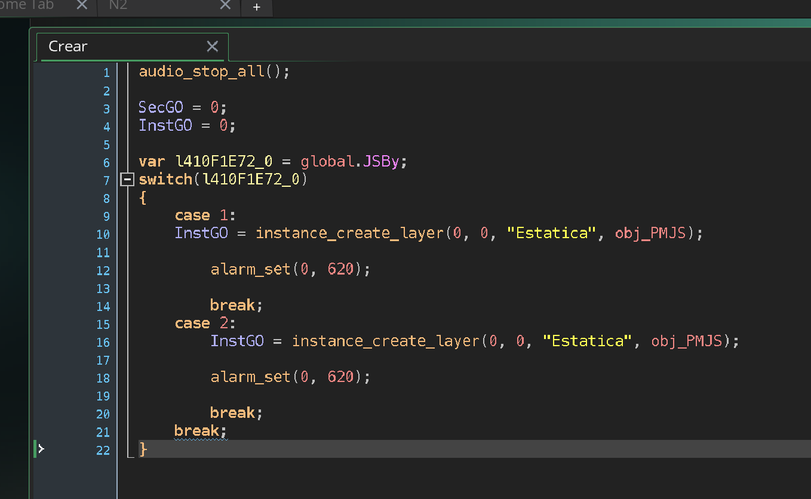
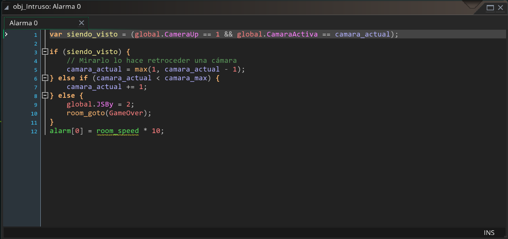
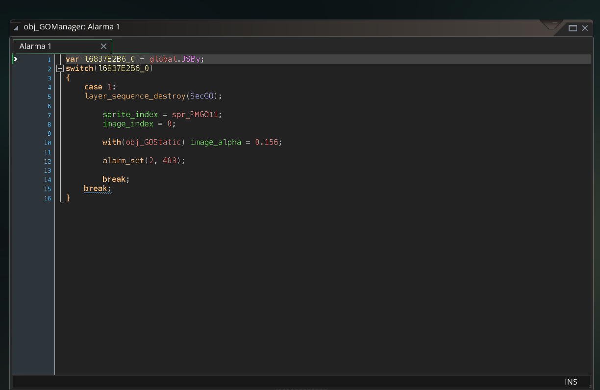
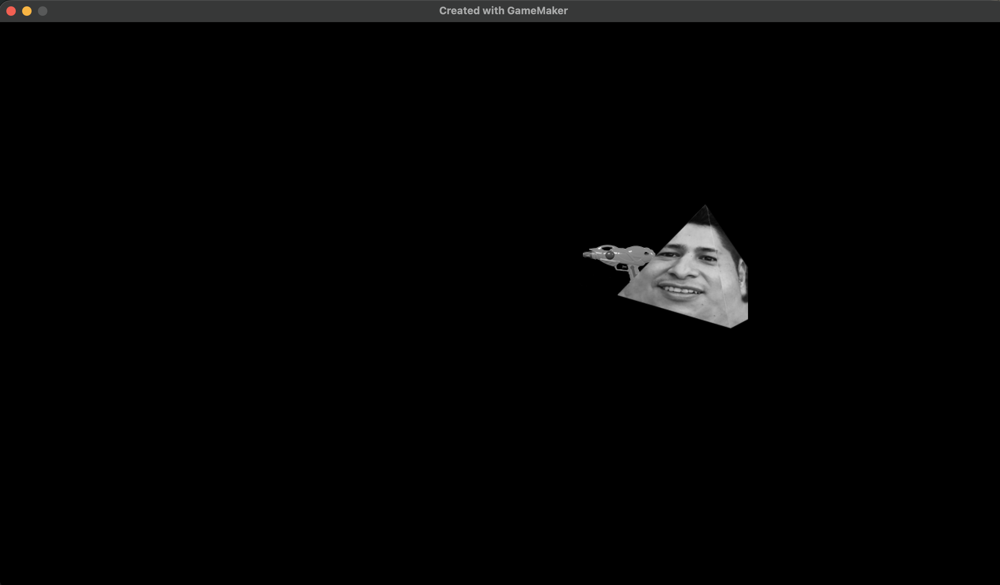
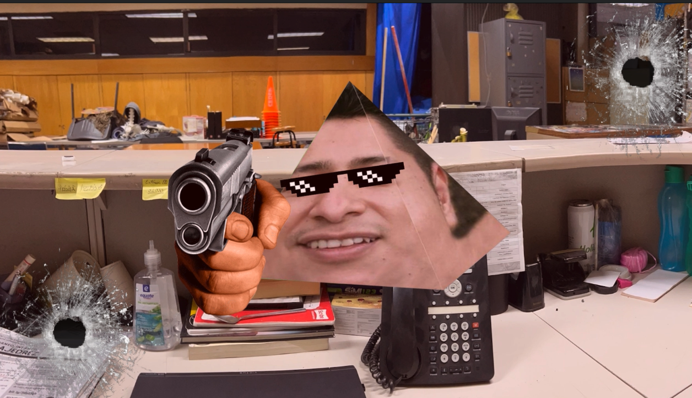

# Pruebas — Parte 3: "Add Night 2"

Matriz de QA para la característica `feature/night-2` (issue a enlazar cuando Ximena la
abra). Casos ejecutados sobre un build local (GameMaker no compila en CI para esta ruta,
ver nota en `.github/workflows/pr-quality-gate.yml`).

**SHA base:** `7ab6b0399ff609349ae73159be7901c03eb799ae`
**SHA probado:** `7497a31feed269ddcda29e09d8cc966f28ea0aa9`
**Dispositivo/entorno:** macOS (Apple Silicon), GameMaker IDE v2026.0.0.16, Runtime v2026.0.0.23

| ID | Tipo | Autor / fecha | Precondiciones | Pasos | Esperado | Real | Estado | Evidencia |
|----|------|----------------|-----------------|-------|----------|------|--------|-----------|
| RF-01 | Ruta feliz | Jose Abel Reyes Castellanos / 2026-10-08 | Partida con Noche 1 recién superada | 1. Ganar Noche 1. 2. Volver al menú. 3. Tocar "Continuar". | El botón está habilitado y lleva directo a la Noche 2 (`room N2`), no a Noche 1. | Confirmado: tras ganar la Noche 1, "Continuar" llevó directo a la sala N2. | Aprobado | [night2-05](night2-05-qa-n2-sin-vigilar-camara.png) |
| LIM-02 | Límite / alterno | [Nombre] / [fecha] | Partida nueva, sin ninguna noche superada (`save.ini` inexistente o en 0) | 1. Abrir el menú principal sin haber jugado antes. | El botón "Continuar" se muestra deshabilitado (opacidad reducida) y no reacciona al toque. | [PENDIENTE] | [PENDIENTE] | [captura] |
| REG-03 | Regresión | [Nombre] / [fecha] | Build con los cambios de Noche 2 aplicados | 1. Iniciar "Nueva partida" (no Continuar). 2. Jugar la Noche 1 normalmente hasta perder o ganar. | La Noche 1 se comporta igual que antes del cambio: batería, cámaras y personajes PM sin alterar. | [PENDIENTE] | [PENDIENTE] | [captura/video] |
| NAV-04 | Navegación / estado | [Nombre] / [fecha] | Noche 1 recién superada (progreso guardado) | 1. Ganar Noche 1. 2. Cerrar la app por completo. 3. Reabrir la app. 4. Tocar "Continuar". | El progreso persiste tras cerrar la app: "Continuar" sigue habilitado y lleva a Noche 2. | [PENDIENTE] | [PENDIENTE] | [captura] |
| A11Y-05 | Accesibilidad | [Nombre] / [fecha] | Menú principal visible | 1. Medir el área táctil del botón "Continuar" en ambos estados. 2. Verificar contraste del estado deshabilitado contra el fondo. | El botón mantiene un área táctil ≥ al resto de los botones del menú; el estado deshabilitado es distinguible pero legible (no desaparece). | [PENDIENTE] | [PENDIENTE] | [captura] |
| COMPAT-06 | Entorno / compatibilidad | Jose Abel Reyes Castellanos / 2026-10-08 | — | Registrar versión de GameMaker Runtime, dispositivo/emulador y SO usados para correr el build. | Build corre sin errores de compilación ni crashes al cargar `N2` o `GameOver`. | Corrió sin errores de compilación; se jugó Noche 1 y se llegó a N2 y a GameOver sin crashes (macOS, GameMaker Runtime v2026.0.0.23). | Aprobado | — |
| RF-07 | Ruta feliz (Intruso) | Jose Abel Reyes Castellanos / 2026-10-08 | En la sala N2, con `obj_Intruso` recién colocado | 1. Llegar a N2 (vía "Continuar"). 2. No vigilar ninguna cámara durante ~20 segundos (4 ciclos de 5s). | Se dispara el jumpscare de `obj_Intruso` (case 2 de `obj_GOManager`) y aparece la pantalla de Game Over. | Confirmado: tras ~20s sin vigilar cámaras, apareció el jumpscare y la pantalla de Game Over, tal como se diseñó. | Aprobado | [night2-05](night2-05-qa-n2-sin-vigilar-camara.png) / [night2-06](night2-06-qa-jumpscare-gameover.png) |

## Estado de la Noche 2 (personaje nuevo + jumpscare)

Implementado por Jose Abel Reyes Castellanos: `obj_Intruso` (mecánica de vigilancia de
cámara) y el `case 2` correspondiente en `obj_GOManager` (Crear, Alarma 0, Alarma 1) para
su jumpscare. Evidencia del desarrollo (código agregado y colocación en la sala `N2`):

*`obj_Intruso` colocado en la sala N2, junto al enemigo existente de la Noche 1.*

*Evento Crear de `obj_GOManager`, ya convertido a código, con el `case 2` nuevo junto al
`case 1` original (sin modificar).*

*Alarma 0 de `obj_GOManager` con el `case 2` nuevo.*

*Alarma 1 de `obj_GOManager` con el `case 2` nuevo.*

**Prueba de juego completa (ver RF-07):** se jugó la Noche 1 completa, se ganó, se usó
"Continuar" para llegar a N2, y se dejó de vigilar las cámaras durante ~20 segundos — el
jumpscare de `obj_Intruso` se disparó correctamente y llevó a la pantalla de Game Over.

*Sala N2 justo después de llegar por "Continuar" — sin fondo/ambientación todavía porque
esa parte (sala y dificultad) es la pieza pendiente de Ximena.*

*Resultado tras ~20 segundos sin vigilar las cámaras: jumpscare y Game Over disparados por el `case 2` de `obj_GOManager`.*

**Pendiente:** el caso en el que SÍ se vigila la cámara correcta constantemente (debe
evitar que `obj_Intruso` avance) no se ha probado todavía — queda para completar antes de
pasar el PR a "Ready for review".

## Hallazgos

[PENDIENTE — defectos encontrados durante las pruebas, cada uno como issue reproducible
del repositorio, enlazada aquí.]
